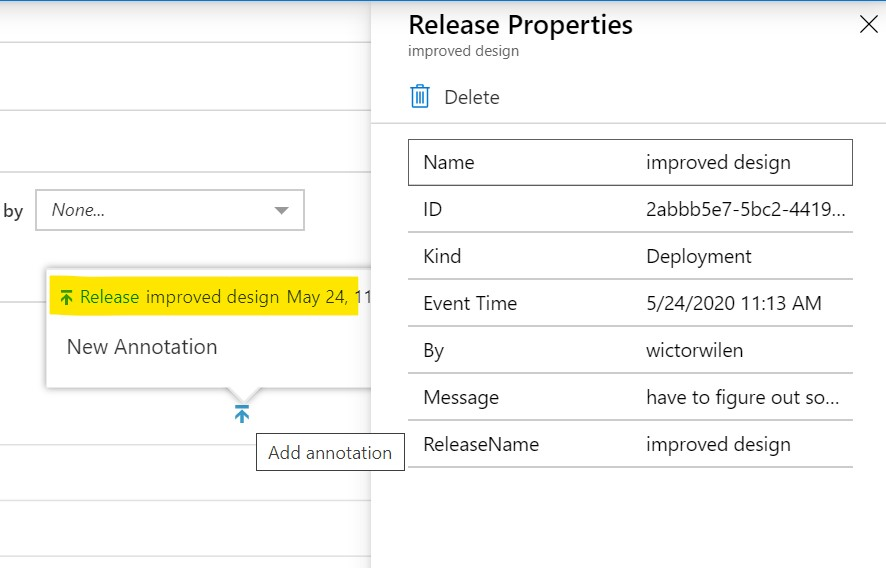

# Application Insights Deploy Annotation Action

A Github Action that creates Deployment annoations in Application Insights


This action allows you to add annotations to the Application Insights timeline so that you with ease can correlate any issues or changes to specific deployments.



## Setup

You need the *Application Id* for your Application Insights instance as well as an *API key*. These values are found in the *API Access* tab. The *API key* is created by selecting *Create API key* and then typing a description and selecting *Write Annotations*. After selecting *Generate key* you will get the generated *API key*. It is strongly recommended to add these two as [Github secrets](https://help.github.com/en/actions/configuring-and-managing-workflows/creating-and-storing-encrypted-secrets) and not reference them directly in your workflow.

## Inputs

The action accepts the following inputs:

* **applicationId** - The Application Id of Application Insights
* **apiKey** - An Application Insights API Key with *Write Annotations* permissions
* **releaseName** - The release name to use in the annotation
* **message** - An optional message
* **actor** - Text to use as created by in the annotation

## Sample configuration

``` yaml
- name: Annotate deployment
  uses: wictorwilen/application-insights-action@v1
  id: annotation
  with:
    applicationId: ${{ secrets.APPLICATION_ID }}
    apiKey: ${{secrets.API_KEY}}
    releaseName: ${{ github.event_name }}
    message: ${{ github.event.head_commit.message }}
    actor: ${{ github.actor }}

```
